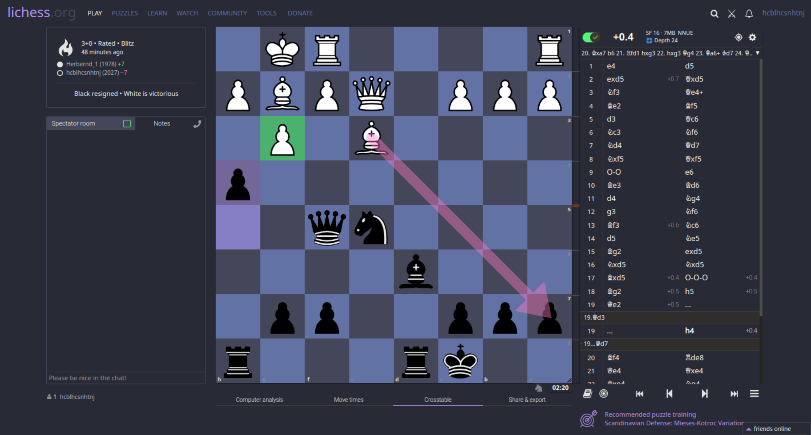

# Dracula for [Lichess](https://lichess.org)

> A dark theme for [Lichess](https://lichess.org).

## Install

All instructions can be found at
[draculatheme.com/lichess](https://draculatheme.com/lichess).

## Team

This theme is maintained by the following person(s) and a bunch of [awesome
contributors](https://github.com/dracula/lichess/graphs/contributors).

|  |
| ------------------------------------------------------------------------------------------------ |
| [Jonathan Scholbach](https://github.com/jonathan-scholbach)                                      |

## Community

-   [Twitter](https://twitter.com/draculatheme) - Best for getting updates about themes and new stuff.
-   [GitHub](https://github.com/dracula/dracula-theme/discussions) - Best for asking questions and discussing issues.
-   [Discord](https://draculatheme.com/discord-invite) - Best for hanging out with the community.

## License

[MIT License](./LICENSE)
